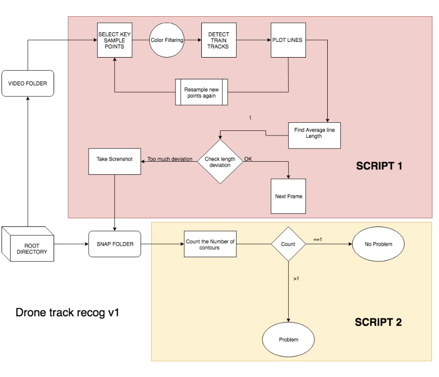

# Train Defect Detector 

OpenCV based video processing pipeline for finding discontinuities on train tracks. 
- Ideal for using on drone footage. 
- Leverages mathematical models of train tracks to detect discontinuities.  
- Built as a large scale automated discontinuity identification for Indian train tracks  

## Pipeline

## Demo 

`python ./scripts/18_07_core-engine-mk3.py`
- requires _test.mp4_ to be available 

## Sample : _Detection_
INPUT IMAGE

OUTPUT IMAGE

## Extra
- Work conducted during an internship at ATL, Hyderabad. 

